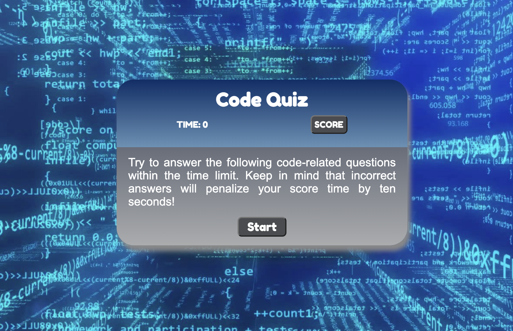
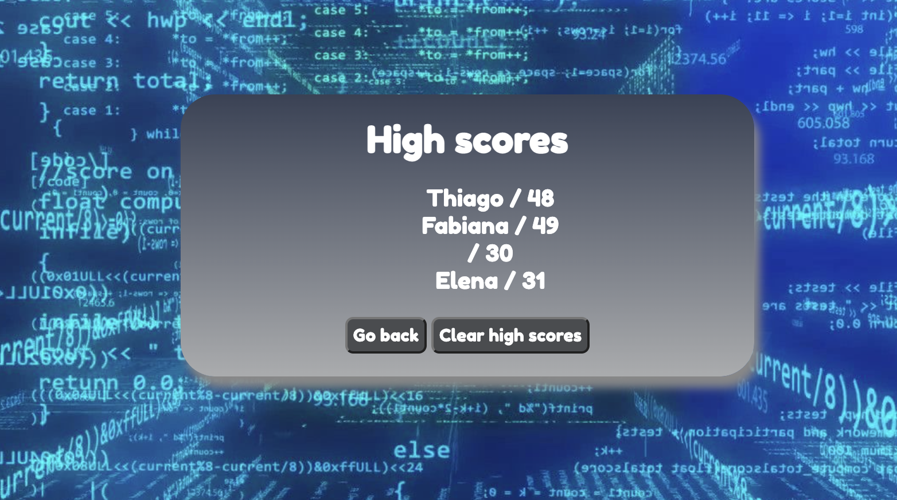
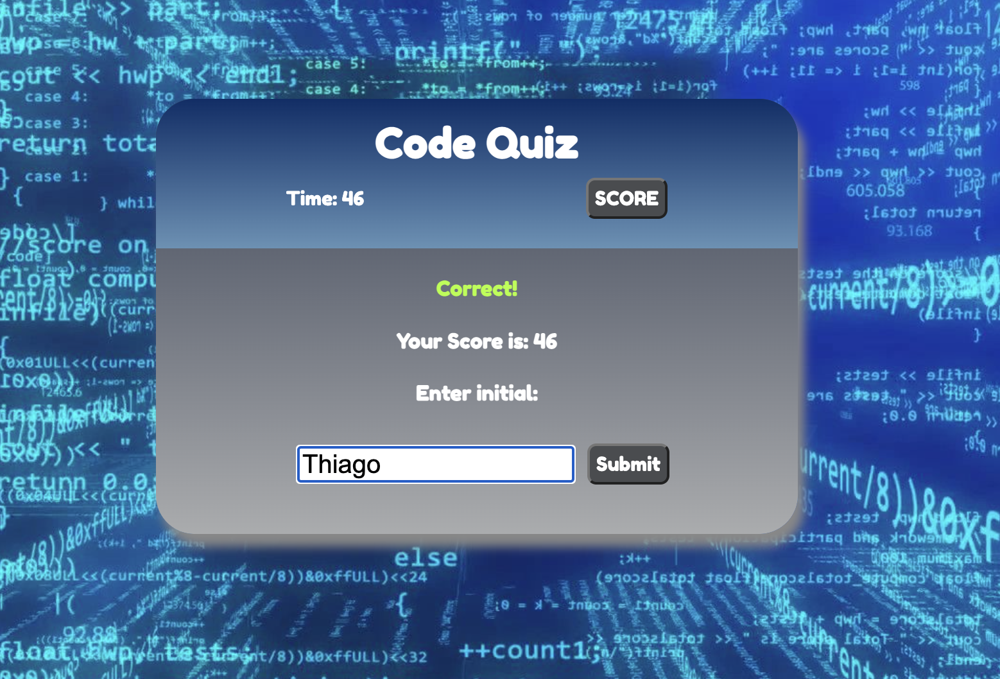
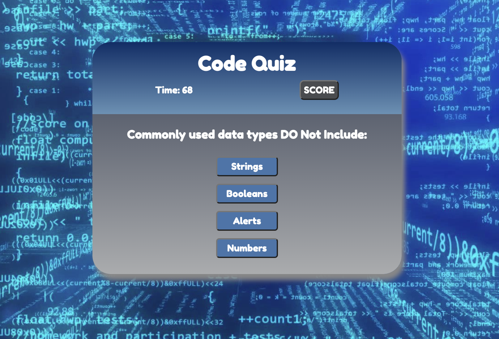

# Code Quiz

## Table of Content
 
 * [Description](#description)
 * [Visuals](#visuals)
 * [Deploy](#deploy)
 * [Github](#github)
 * [Technologies](#technologies)
 * [Support](#support)
 * [Author](#author)
 * [Linkedin](#linkedin)

## Description

Timed coding quiz with multiple-choice questions using JavaScript fundamentals that stores high scores.

## Visuals

## Deploy
https://thiago-nasciutti.github.io/code-quiz/

## Github
https://github.com/thiago-nasciutti/code-quiz

## Technologies
       

## Support
nasciutti.thiago@gmail.com

## Author
Thiago Borges Nasciutti

## Linkedin
https://www.linkedin.com/in/thiago-nasciutti/
